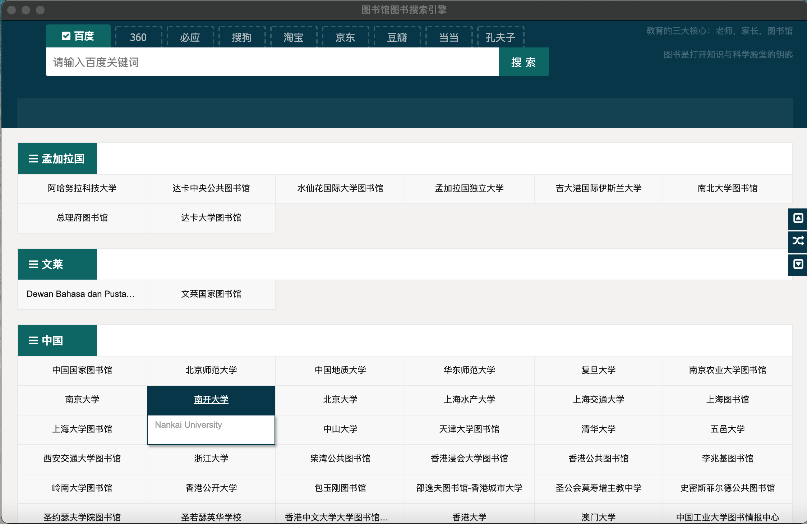
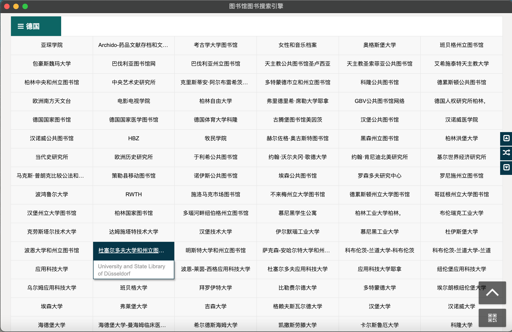
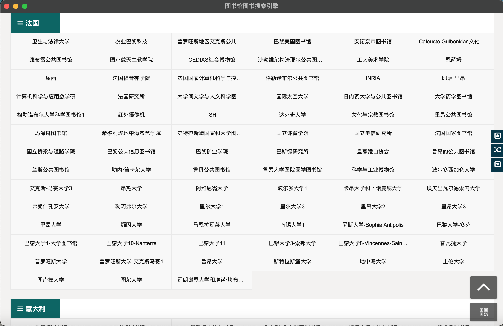
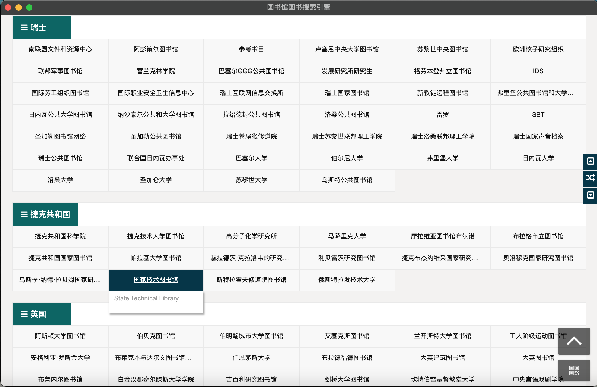
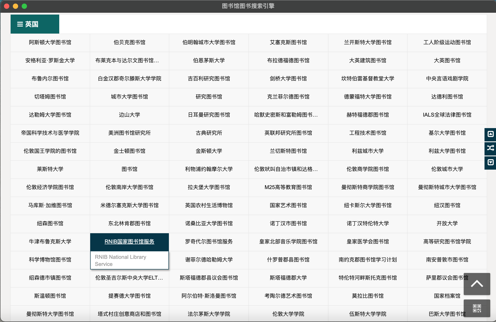
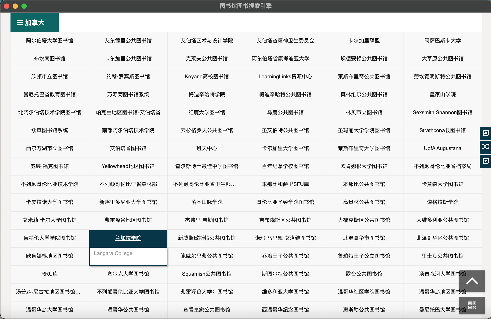
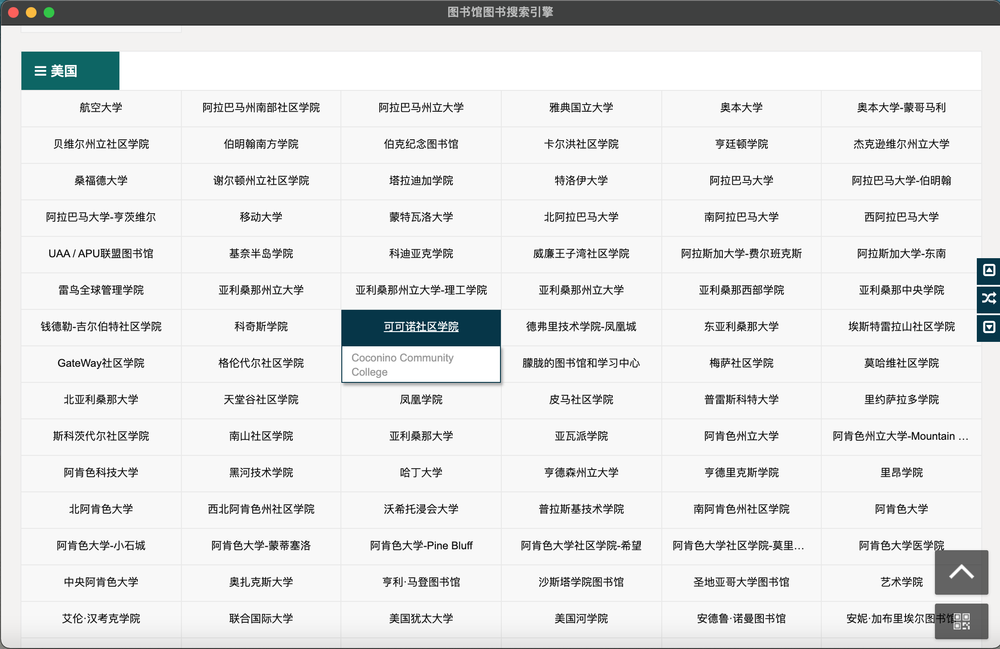

  
  <h1>LibraryBookSearchEngine 图书馆图书搜索引擎 Pro</h1>
  
LibraryBookSearchEngine，link librarys  of all Countries, search all resources of books. 
图书馆图书搜索引擎,在家链接全球148个国家的公共图书馆，学校图书馆，聚合查找搜索引擎，图书网站相关图书资源
计划支持全球197个国家和地区。

  

开发背景：
2019年底新冠疫情，基本在长沙岳麓区无法出门开展工作，看书，网上谈生意，找电子书，搜图书，搜云盘，非常麻烦，于是开始
构思设计一款能搜索图书，又能搜索图书馆的桌面软件，于是开始搜集国内外的图书馆资料，集成国内主流的图书搜索引擎，包括豆瓣评论，
搜集了148个国家的主流公共图书馆，大学图书馆网址，建立了一个图书馆库。

开发计划：
图书馆图书搜索引擎V1.0
2020  LibraryBookSearchEngineV1.0 
功能：
1.包含148个国家的主流公共图书馆，大学图书馆网址。
2.包含百度、360、必应、搜狗、淘宝、京东、豆瓣、当当、孔夫子9个图书搜索引擎

2022  LibraryBookSearchEngineV2.0
图书馆图书搜索引擎V2.0

功能：
1.覆盖中国2956高校的开放图书馆。  V2.0
2.支持中国2522个县级以上三级图书馆 V2.0

2022  LibraryBookSearchEngineV3.0
图书馆图书搜索引擎V3.0

功能：
1.在原有148个国家的覆盖到全球共有197个国家的主流公共图书馆，大学图书馆网址库。

  

  

    
    
    
    
  
  

================深度交流================

  

================图书馆图书搜索引擎主页================

  

================德国系列================

  

================法国系列================

  

================瑞士系列================

  

================英国系列================

  

================加拿大系列================

  

================美国系列================

=================深度交流==================

      人生90%的机会来自于人脉和有效信息

================分微矩阵社区================

	
	
	[分微社区公众号官网]
	微信公众号(fenwii-tec)：分微科技
	Github: https://github.com/fenwii
	Gitee: https://gitee.com/samir
	
	[分微技术社区]
	编程技术交流知识星球：C语言C++汇编研究中心   https://t.zsxq.com/jeYVJuj
	

  

  

================分微矩阵社区================

=================深度交流==================

# Star History

